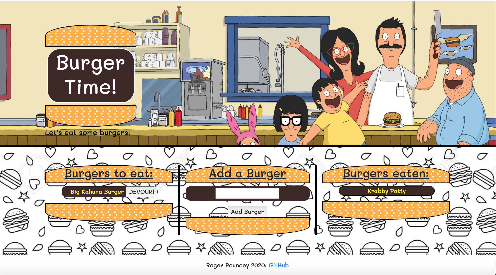
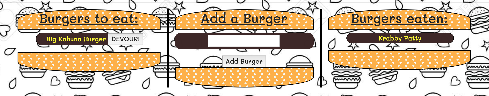

# Burger Time!

### **by Roger Pouncey** 

A burger logger app that follows the MVC design pattern and uses MySQL, Node, Express, jQuery, Handlebars, Bootstrap, and a homemade ORM.

Email: rpounceyjr@gmail.com

## **Table of Contents** 

#### i. [Installation](#installation)

#### ii. [Usage](#usage)

#### iii. [Contributing](#contributing)

#### iv. [Tests](#tests)

#### v. [Questions](#questions)

## **Installation** 
 
                $ npm i

## **Usage** 

This web application can be used to add and delete burgers from a burger logger. When the page loads, a query is sent to a MySQL database to retrieve any saved burgers.  Burgers are sorted and appended to the one side or other of the page depending on whether or not they have been eaten. Users can enter a burger name in the "Add a Burger" input field.  Upon clicking the "Add Burger" button, the burger's name, it's "devoured" state (which defaults to false), and an auto-icrementing ID are passed to a table in the database via a custom ORM.  The page is then reloaded, the new burger being pulled from the database with the other burgers and added to the list of burgers to eat.  All uneaten burgers feature a "DEVOUR!" button next to their name.  Once clicked, this button changes the "devoured" state of the burger to true, the page is reloaded, and the burger is moved to the "Burgers eaten" list."

For this app, jQuery is used for the frontend JavaScript.  In the backend, Node and Express are used for logic and to route requests. Once retreived from the MySQL database, elements are applied to the page dynamically using Handlebars templates.  Styling is achieved with Bootstrap and CSS. The app is hosted through Heroku at https://afternoon-mesa-77048.herokuapp.com/.

## **Contributing** 

This project was created by Roger Pouncey.  Improvements can be made to the app by making a pull request on GitHub.

## **Tests** 

No tests were performed on this app.

## **Questions** 

Questions about this app can be addressed to Roger Pouncey, either through GitHub or via the above email address.